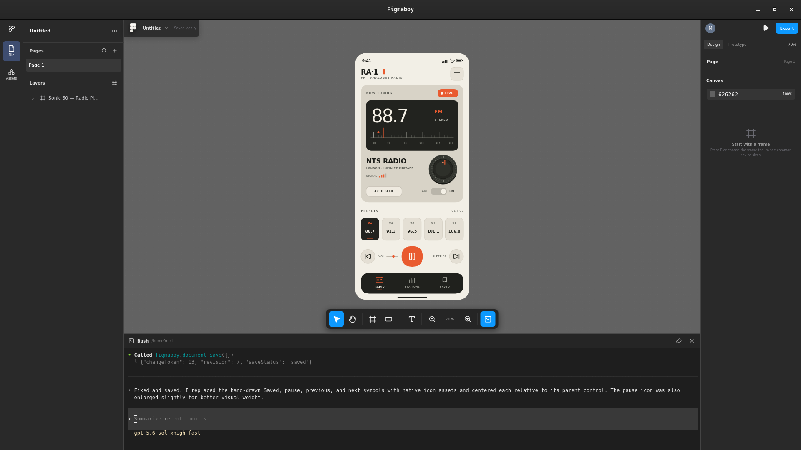

# Figmaboy

**A local-first Figma clone with Codex CLI built directly into the desktop app.**

Design interfaces by hand with a familiar canvas, layers, frames, and inspector—or open the embedded terminal and ask Codex to inspect and edit the live document for you. Codex's changes appear immediately as native, editable layers with undo/redo and local autosave.



[](https://github.com/0xmiki/figmaboy/actions/workflows/ci.yml)
[](https://github.com/0xmiki/figmaboy/releases/latest)
[](LICENSE)

## Download

Download the latest installers from [GitHub Releases](https://github.com/0xmiki/figmaboy/releases/latest):

- Linux: AppImage, Debian package, and RPM package
- macOS: DMG builds for Apple Silicon and Intel
- Windows: NSIS and MSI installers
- MCP: standalone `figmaboy-mcp` binaries for every release target

Release assets include `SHA256SUMS` for verification. The Linux packages install both `figmaboy` and `figmaboy-mcp`; AppImage users can download the matching standalone MCP binary from the same release.

macOS builds are currently ad-hoc signed rather than notarized, so the first launch may require approval in **System Settings → Privacy & Security**. Windows builds are not code-signed yet and may show a SmartScreen warning.

## Codex design MCP

Figmaboy includes a companion `figmaboy-mcp` stdio server. It can use saved designs as read-only Codex context while the desktop app is closed, or edit the design currently open in the app with live undo/redo and autosave.

### Use saved designs as Codex context

Right-click a design card in the Figmaboy workspace and choose **Copy design ID**, or use the copy button beside the file name in the editor. IDs are stable and unambiguous, so they are the best way to reference an important design:

> Build the interface from the Figmaboy design `file_…`, page `Home`.

Names work too when they are unique:

> Use the Figmaboy design named `Marketing site` as the visual and layout reference.

The MCP exposes two offline tools:

- `designs_list` searches saved designs and returns their IDs, names, projects, timestamps, and page counts.
- `design_context_get` accepts either `fileId` or `fileName`, plus an optional `pageId` or `pageName`. It returns the latest autosaved page revision, complete native document, ordered layer tree, asset metadata, and a visual preview.

If multiple active designs have the same name, the MCP returns their project names and IDs so Codex can retry with an exact ID. Offline context is always read-only; open the design in Figmaboy before asking Codex to change it.

### Runtime architecture

The desktop app and MCP server are separate processes with two data paths:

```text
Codex (or another MCP client)
        │ JSON-RPC over stdio
        ▼
figmaboy-mcp
        ├── read-only SQLite ───────────────► saved pages, layers, previews
        │                                     (app open or closed)
        │
        └── authenticated 127.0.0.1 bridge ─► currently open editor
                                              (live inspect and edit)
```

1. Figmaboy autosaves native page documents and per-page previews to its local SQLite workspace.
2. `figmaboy-mcp` opens that database in SQLite read-only mode for `designs_list` and `design_context_get`. WAL mode keeps reads safe while the app is saving.
3. Figmaboy starts an editor bridge on a random loopback-only port when the desktop app opens.
4. The app writes `editor-bridge.json`, containing the port, a random authentication token, and its process ID, to the local application-data directory. On Unix the file is restricted to the current user with mode `0600`.
5. The MCP client launches `figmaboy-mcp` as a normal stdio server. The desktop app does **not** launch it.
6. Live tools connect through the bridge; the editor performs mutations and rendering and returns the result through the same path.

The MCP process never writes to the SQLite database. This keeps validation, undo/redo, live rendering, revision checks, and autosave inside the desktop app.

The default discovery file is located at:

| Platform | Path |
| --- | --- |
| Linux | `${XDG_DATA_HOME:-$HOME/.local/share}/com.miki.figmaboy/editor-bridge.json` |
| macOS | `~/Library/Application Support/com.miki.figmaboy/editor-bridge.json` |
| Windows | `%LOCALAPPDATA%\com.miki.figmaboy\editor-bridge.json` |

Set `FIGMABOY_BRIDGE_FILE` for the MCP process only when a non-default discovery path is required.

Set `FIGMABOY_DB_PATH` to override the saved workspace database path, primarily for portable installations and tests.

### Install and register with Codex

The desktop package must install both the GUI and the companion `figmaboy-mcp` executable. The current NixOS package exposes both on `PATH`. Register its absolute path so Codex does not depend on the environment from which it was launched:

```console
MCP_BIN="$(command -v figmaboy-mcp)"
test -n "$MCP_BIN"
codex mcp add figmaboy -- "$MCP_BIN"
codex mcp list
```

If `figmaboy` is already registered to a binary inside an old repository checkout, replace that entry first:

```console
codex mcp remove figmaboy
codex mcp add figmaboy -- "$(command -v figmaboy-mcp)"
```

On macOS or a non-Nix Linux package, use the absolute installed path in the same command:

```console
codex mcp add figmaboy -- /absolute/path/to/figmaboy-mcp
```

On Windows, run the equivalent command in PowerShell with the installed `.exe` path:

```powershell
codex mcp add figmaboy -- "C:\absolute\path\to\figmaboy-mcp.exe"
```

After registration, begin a new Codex session. Saved-context tools work whether Figmaboy is open or closed. Live editor and mutation tools require an open design and report a clear error when the app is unavailable.

Tauri's `externalBin` setting ensures that release artifacts contain the MCP executable, but it does not register the server with Codex and does not automatically expose the executable on `PATH`. Each platform installer must provide a stable executable path for the registration command. The NixOS package already does this.

### Tools and authoring contract

The server exposes offline tools to find saved designs and load a page as structured-plus-visual Codex context. Its live tools inspect editor state and nodes, retrieve exact coordinate geometry, atomically create/update/delete/reparent/reorder layers, place generated image assets, center layers horizontally/vertically, set border radii, control selection and viewport focus, undo/redo/save, and capture a complete frame as PNG evidence.

Codex builds designs entirely from native frames, groups, shapes, text, images, and icons. Every visible element remains addressable through MCP and editable in the layer panel. The `design_capabilities` tool returns the current node/style contract plus the expected semantic grouping model; Codex should call it before authoring a design.

Native styling currently includes solid, linear-gradient, and radial-gradient fills; independent corner radii; stroke width, dash, cap, and join controls; blend modes; layered drop shadows and blur; and expanded typography (arbitrary font families, weight, italic, case, decoration, vertical alignment, resizing, paragraph spacing/indentation, and truncation). Designs should use one top-level frame per screen, section-level frames/groups, and named component groups instead of a flat root layer list.

Right-click any frame and choose **Copy as image** to place a high-resolution rasterization of the frame and all of its descendants on the system clipboard. The renderer targets a 3840 px long edge where possible, renders at no less than 2× for ordinary frame sizes, and preserves aspect ratio within the 4096 px safety limit. On Linux it offers both PNG pixels and a cached PNG file URI, so the result can be pasted into image-aware applications or directly into a folder.

The machine-readable TypeScript contract lives at [`mcp/types.ts`](mcp/types.ts) and is returned by the `types_get` MCP tool. Codex should use `nodes_center` for Figma-style center alignment, `nodes_set_border_radius` for rounded surfaces, and `frame_screenshot` to visually review every completed frame.

### Generated artwork

Codex can create hero art, backgrounds, product imagery, textures, illustrations, logos, or transparent cutouts with its image-generation capability and then call `image_place` with the final local PNG, JPEG, or WebP path. Figma Boy validates and persists the file in its asset database and creates a normal editable image layer. For a background, pass the containing frame as `parentId`, use `placement: "fill-parent"`, `fit: "cover"`, and `index: 0`; for a logo or cutout, use a transparent PNG with natural placement and an explicit position/size. Finish by calling `frame_screenshot` and reviewing the composition.

### Development server

Build and register an MCP binary directly from this checkout:

```console
nix-shell --run 'cargo build --locked --release --manifest-path src-tauri/mcp/Cargo.toml'
codex mcp add figmaboy -- "$(pwd)/src-tauri/target/release/figmaboy-mcp"
```

Remove an existing `figmaboy` entry first when switching between an installed package and a repository build.

### Bundled sidecar

Tauri builds include `figmaboy-mcp` as an external binary. The development and release hooks compile it for the selected target and stage it with Tauri's required target-triple filename automatically. To prepare and validate the current host binary directly:

```console
nix-shell --run 'bun run sidecar:prepare'
nix-shell --run 'bun run sidecar:smoke'
```

Generated sidecar binaries live under `src-tauri/binaries/` and are not committed. `bun run tauri dev` prepares a debug sidecar; production Tauri builds prepare a release sidecar.

## Development

Run `nix-shell`, then `bun run tauri dev`.

## Recommended IDE setup

[VS Code](https://code.visualstudio.com/) + [Svelte](https://marketplace.visualstudio.com/items?itemName=svelte.svelte-vscode) + [Tauri](https://marketplace.visualstudio.com/items?itemName=tauri-apps.tauri-vscode) + [rust-analyzer](https://marketplace.visualstudio.com/items?itemName=rust-lang.rust-analyzer).
